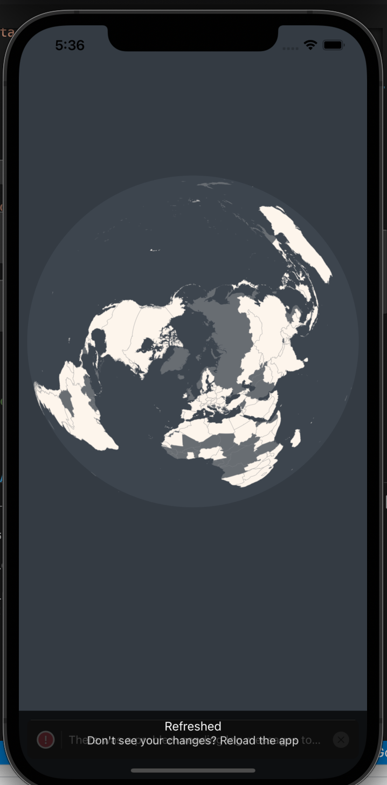

# native_map

## This is my MVP of a responsive mobile map showing the most recent data on worldwide Covid-19 cumulative deaths, by country. 

## the app was built using Expo, React Native, react-native-gesture-handler, and D3. It seemed like there was a new package version of d3-array released literally mid-build as out of nowhere i started having issues with incompatible dependencies and the more i tried to fix them, the more issues I created! I learned a good lesson here - know exactly what tools you're going to be using before you start building, and make sure everything is compatible and still working, or you may end up wasting a whole lot of time. 

## The colorization is based on the number of daily confirmed deaths and total confirmed accumulated deaths by Covid-19 in each region. The darker the color the higher the number of fatalities. 

## If you want to see that the data visualization is working, go to App.JS and change the date that's in state on line 28. 

## Depending on what device you're using to view the app, you may see one or two error messages once expo loads to 100%. Just 
## For now I will have to manually update the data but the plan is to add an API from the WHO for daily so that it updates automatically every day. I will also create an interactive key so that users can toggle between different data topics. 

### covid data comes from covid19.who.it
### special thanks to @GeoLic for sharing his passion for data visualization, and explaining this process in such painstaking detail. I'm really glad JavaScript is the same in English and German!

